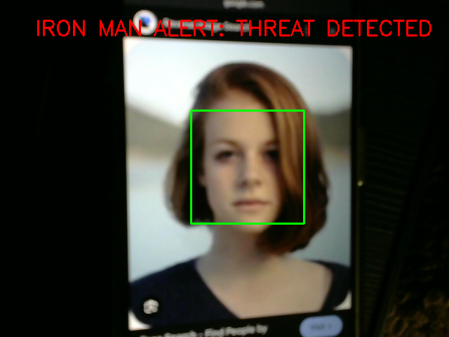

# Anomaly Detection using Object Detection

## Description
This project detects anomalies using a webcam and OpenCV.

## Method
- Face detection using Haar Cascade
- Any detected face is treated as anomaly

## Features
- Real-time webcam detection
- Alert system ("IRON MAN ALERT: THREAT DETECTED")
- Bounding box around detected face

## Result
The system successfully detects a face and triggers an anomaly alert in real time.

## Screenshot

## UI Theme
Inspired by Iron Man AI interface
